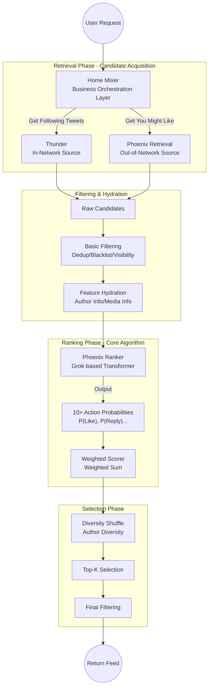

# Chapter 1: System Overview

## 1.1 Introduction: Algorithm Engineer's Perspective

As an algorithm engineer, when encountering X's recommendation system (For You Feed), you might be surprised by its **simplicity**. Unlike traditional recommendation systems that stack a large number of hand-engineered features, this system adopts an **End-to-End** deep learning paradigm.

The core philosophy can be summarized as:
> **Eliminate hand-engineered features.**
> Let the model automatically learn what "relevance" is by understanding the user's **Action Sequence** and the **Content Embeddings** themselves.

## 1.2 System Architecture Panorama

The entire recommendation service can be seen as a huge funnel, screening the top-K most relevant tweets from massive amounts of content.

## 1.3 The Three Musketeers (Core Components)

Understanding these three components is key to mastering the entire system:

### 1. Home Mixer (The Commander)
- **Position**: Business logic orchestration layer, implemented in Rust.
- **Responsibility**: It does not store data nor train models. It acts like a "motherboard", connecting retrieval sources, feature services, and model services.
- **Core Logic**: Based on the `CandidatePipeline` framework, defining the standard process of data flow: `Source -> Hydrator -> Filter -> Scorer -> Selector`.

### 2. Thunder (Internal Memory)
- **Position**: In-Network (Following stream) real-time storage and retrieval engine.
- **Responsibility**:
    - Stores users' recent tweets (In-memory, extremely efficient).
    - When a user refreshes the Feed, quickly returns tweets posted by people they **follow**.
    - Handles Kafka message streams to update tweet status in real-time.

### 3. Phoenix (The Brain)
- **Position**: Deep learning-based recommendation algorithm center.
- **Responsibility**:
    - **Retrieval**: Uses a Two-Tower model to retrieve content the user might be interested in from massive tweets across the network (Out-of-Network).
    - **Ranking**: Uses a Grok-1 based Transformer model to unifiedly score all candidate tweets (whether following or not).
    - **Features**: The model directly predicts the probability of various user interactions (Like, Reply, Repost, etc.) with the tweet.

## 1.4 Data Flow

When a user refreshes the "For You" page, the data flow is as follows:

1.  **Request Initiation**: `Home Mixer` receives the request.
2.  **Context Acquisition**: Get current user features (User Features) and historical action sequence (User Action Sequence).
3.  **Dual Retrieval**:
    *   Ask `Thunder` for "tweets from following".
    *   Ask `Phoenix Retrieval` for "network-wide hot/relevant tweets".
4.  **Feature Completion**: Use tweet IDs to pull tweet details and author details from feature services (like Gizmoduck, User Data Service).
5.  **Initial Screening**: Filter out read, blocked, and sensitive content.
6.  **Unified Scoring**: Package the processed candidate set (content + user history) and send it to `Phoenix Ranker`.
7.  **Calculate Total Score**: Model returns predicted probabilities -> Weighted Sum -> Final Score.
8.  **Truncate & Return**: Sort by score, take top K, and return to the client.

## 1.5 Summary

The biggest highlight of this architecture is **Unity**.
Regardless of where the content comes from (Following vs Out-of-Network), it is ultimately scored fairly by the same powerful Transformer model (Phoenix). This ensures that the quality of content distribution mainly depends on the relevance between the content and the user, rather than the source channel.

---
**Next Step**: Read `02_home_mixer_logic.md` to dive deeper into the code implementation details of the business orchestration layer.
