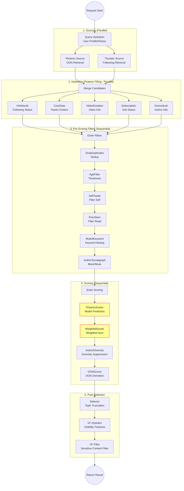

# Chapter 2: Home Mixer Logic Explained

`Home Mixer` is the "brain" and "commander" of the entire recommendation system. It does not produce data but is responsible for coordinating various components to complete the entire process from request to response.

## 2.1 Core Design Pattern: Pipeline

Home Mixer adopts the **Pipeline** design pattern. This pattern decomposes the complex recommendation process into a series of standardized, pluggable steps.

Code location: `candidate-pipeline/lib.rs` defines these Traits (interfaces):

| Phase (Trait) | Responsibility | Component Examples |
| :--- | :--- | :--- |
| **Source** | **Sourcing**. Responsible for fetching raw candidate IDs from upstream data sources. | `ThunderSource`, `PhoenixSource` |
| **Hydrator** | **Prep**. Responsible for enriching candidate data (feature filling). | `CoreDataHydrator` (fetch tweet details), `GizmoduckHydrator` (fetch author info) |
| **Filter** | **Screening**. Responsible for removing invalid candidates. | `DropDuplicatesFilter` (dedup), `MutedKeywordFilter` (muted keywords) |
| **Scorer** | **Cooking**. Responsible for scoring each candidate. | `PhoenixScorer` (model prediction), `WeightedScorer` (weighted sum) |
| **Selector** | **Plating**. Responsible for sorting and selecting Top-K. | `TopKScoreSelector` |
| **SideEffect** | **Cleanup**. Responsible for asynchronous non-blocking tasks. | `CacheRequestInfoSideEffect` (logging/caching) |

## 2.2 Core Implementation: PhoenixCandidatePipeline

`PhoenixCandidatePipeline` is the most important Pipeline implementation in Home Mixer, specifically for the "For You" Feed.

Code location: `home-mixer/candidate_pipeline/phoenix_candidate_pipeline.rs`

Let's dive into the source code to see how it is assembled:



### 2.2.1 Assembling Sources
```rust
// This is a mixed source Pipeline, containing two sources:
let phoenix_source = Box::new(PhoenixSource { ... }); // Retrieval Source (Out-of-Network)
let thunder_source = Box::new(ThunderSource { ... }); // Following Source (In-Network)
let sources = vec![phoenix_source, thunder_source];
```
The system calls these two Sources **in parallel** and then merges the results. This reflects the design idea of "Mixed Stream".

### 2.2.2 Assembling Hydrators
```rust
let hydrators = vec![
    Box::new(InNetworkCandidateHydrator), // Mark if following
    Box::new(CoreDataCandidateHydrator::new(...)), // Core data: content, media links
    Box::new(VideoDurationCandidateHydrator::new(...)), // Video duration
    Box::new(SubscriptionHydrator::new(...)), // Subscription/Paywall status
    Box::new(GizmoduckCandidateHydrator::new(...)), // Author info: Blue check, follower count, etc.
];
```
Note: Hydration is one of the most time-consuming steps, usually optimized through asynchronous concurrent requests.

### 2.2.3 Assembling Filters
```rust
let filters = vec![
    Box::new(DropDuplicatesFilter), // Dedup
    Box::new(AgeFilter::new(...)), // Filter out too old tweets
    Box::new(SelfTweetFilter), // Don't recommend own tweets
    Box::new(PreviouslySeenPostsFilter), // Filter out read
    Box::new(MutedKeywordFilter::new()), // Keyword muting
    // ... more filters
];
```
The order of filters is important; generally, filters with low computational cost and high filtering ratio are placed first.

### 2.2.4 Assembling Scorers
This is the part algorithm engineers care about most. They are executed **sequentially**, and later Scorers can use the results of previous Scorers.

```rust
let scorers = vec![
    // 1. Core Model Scoring: Call Grok Transformer to predict P(Like), P(Reply), etc.
    Box::new(PhoenixScorer { phoenix_client }), 
    
    // 2. Weighted Fusion: Weighted sum of probabilities above to get weighted_score
    Box::new(WeightedScorer),
    
    // 3. Diversity Suppression: If the same author appears multiple times, lower the score
    Box::new(AuthorDiversityScorer::default()),
    
    // 4. OON Demotion: (Optional) Demote non-following content to balance Feed ratio
    Box::new(OONScorer),
];
```

## 2.3 Why Design Like This?

1.  **Decoupling**: Business logic (Filters, Scorers) is separated from the execution framework (Pipeline Runner). Algorithm engineers only need to write new Scorers without worrying about concurrency control and error handling.
2.  **Flexibility**: Want to add a new filtering rule? Just implement the `Filter` trait and add it to the `vec!` list, no need to modify the core flow.
3.  **Testability**: Each component (like `AgeFilter`) can be unit tested individually.

## 2.4 Key Data Structure: PostCandidate

The core data structure flowing through the Pipeline is `PostCandidate`.

```rust
pub struct PostCandidate {
    // Basic ID
    pub tweet_id: u64,
    pub author_id: u64,
    
    // Source Marker
    pub in_network: Option<bool>, // true=from following, false=from recommendation
    
    // Model Scoring Results (Filled by PhoenixScorer)
    pub phoenix_scores: PhoenixScores, 
    
    // Final Score (Calculated by WeightedScorer)
    pub weighted_score: Option<f64>,
    
    // ... other feature data
}
```

---
**Next Step**: Read `03_phoenix_model.md` to dive into the algorithm core and understand the mysterious Grok-based Transformer model.
