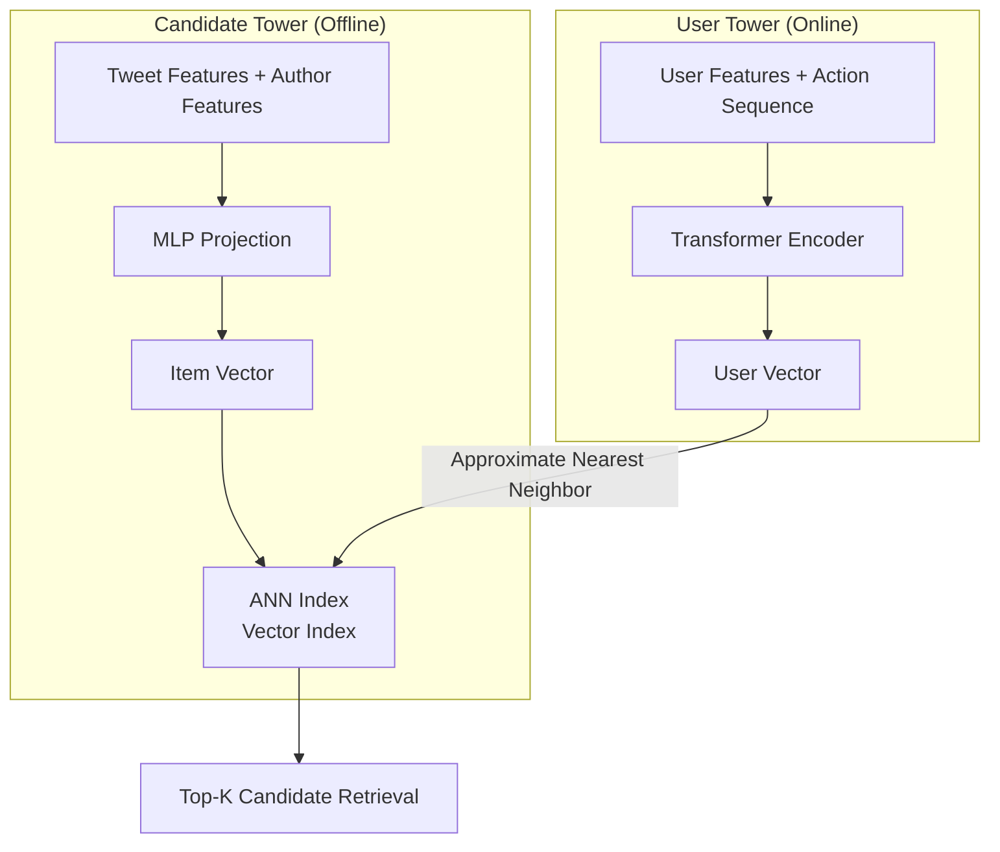
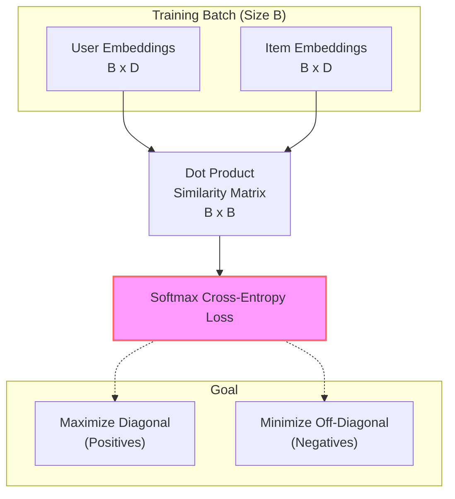
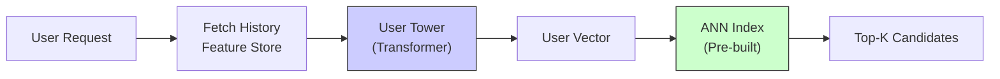
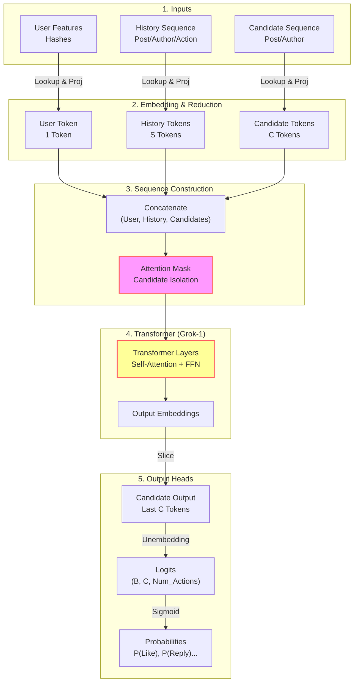

# Chapter 3: Core Algorithm Model (Phoenix Model)

Phoenix is the core algorithm engine of the entire recommendation system, implemented based on JAX. It consists of two main parts: **Retrieval** and **Ranking**.

Code location: `phoenix/` directory.

## 3.1 Retrieval: Two-Tower Model

In the retrieval phase, we need to quickly find hundreds of relevant tweets from hundreds of millions. The classic Two-Tower structure is used here.

### 3.1.1 Architecture Principle

Phoenix's Two-Tower model does not use Graph Neural Networks like LightGCN, but adopts a **Transformer + MLP** hybrid architecture:

*   **User Tower**: Uses **Transformer** (Grok-1 architecture).
    *   Reason: User interests are mainly reflected in their Action Sequence (History Sequence), and Transformer excels at capturing sequence features.
    *   Output: `User Embedding [D]`
*   **Candidate Tower (Item Tower)**: Uses **MLP (Multi-Layer Perceptron)**.
    *   Reason: Tweet features (ID, Author, Surface features, etc.) are relatively static and structurally simple, MLP is efficient enough.
    *   Output: `Item Embedding [D]`
*   **Similarity Calculation**: Uses Dot Product.



### 3.1.2 Why Two-Tower?
The biggest advantage of Two-Tower is **Decoupling**.
*   **Offline Calculation**: We can pre-calculate Item Embeddings for all tweets on the network and build an ANN (Approximate Nearest Neighbor) index.
*   **Online Service**: When a user request comes, only the User Embedding needs to be calculated in real-time, then vector search is performed in the index, which is extremely fast.

### 3.1.3 Training Method

The core of Two-Tower model training is **Contrastive Learning**.

**Training Objective**:
Make the distance between User Embedding and Item Embedding actually interacted by the user (Positive Samples) as close as possible, and the distance from uninteracted Item Embedding (Negative Samples) as far as possible.

**In-batch Negatives**:
To improve training efficiency, we usually do not explicitly sample negative samples, but use other samples in the Batch as negative samples. Assuming a Batch has $B$ samples, each comprised of `(User_History, Target_Item)`:
*   **Positive Sample**: For the $i$-th user $U_i$, the corresponding positive sample is $I_i$ (the Item the user actually interacted with).
*   **Negative Sample**: All other Items $I_j (j \neq i)$ in the Batch are considered negative samples for $U_i$.

Thus, a Batch can construct a $B \times B$ similarity matrix.

**Loss Function**:
Uses **Softmax Cross-Entropy Loss**. For each user $U_i$, we want the model to correctly "classify" $I_i$ from the $B$ Items in the Batch.

$$
L = -\frac{1}{B} \sum_{i=1}^{B} \log \frac{\exp(sim(U_i, I_i) / \tau)}{\sum_{j=1}^{B} \exp(sim(U_i, I_j) / \tau)}
$$

Where $sim(\cdot)$ is dot product similarity, and $\tau$ is the temperature coefficient.



### 3.1.4 Online Inference

When a user request arrives, the system needs to calculate User Embedding and retrieve in real-time.

**Process**:
1.  **Feature Fetching**: Pull user's latest interaction history sequence (e.g., last 50 interactions) from Feature Store.
2.  **User Tower Inference**: Input sequence into User Tower (Transformer).
    *   **Low Latency Principle**: Sequence length in recommendation scenarios is usually short (e.g., 32~128), Transformer processes this length very fast (milliseconds).
    *   **One-sided Calculation**: At this point, Item Tower calculation is **not needed**. Vectors for all Items on the network are already pre-calculated and indexed.
3.  **ANN Retrieval**: Use the calculated User Embedding to find K nearest Items in the ANN index.



## 3.2 Ranking: Candidate Isolation Transformer

In the ranking phase, we face hundreds of candidates returned by retrieval, allowing for more complex models. The Phoenix Ranking Model is a Grok-1 based Transformer.



### 3.2.1 Core Innovation: Candidate Isolation

In ordinary Transformers (like BERT/GPT), all tokens in the sequence can see each other (Self-Attention). But in recommendation ranking, if we input `[User, Candidate A, Candidate B, ...]` together, there is a serious problem:
> **The score of Candidate A might be affected by the presence of Candidate B.**

This leads to unstable scoring and inability to cache.
Phoenix solves this through a carefully designed **Attention Mask**:

```
Attention Mask (Who sees whom):
          | User | History | Cand A | Cand B |
----------|------|---------|--------|--------|
User      |  ✅  |    ✅    |   ❌   |   ❌   |
History   |  ✅  |    ✅    |   ❌   |   ❌   |
Cand A    |  ✅  |    ✅    |   ✅   |   ❌   |  <-- A only sees User/History and self
Cand B    |  ✅  |    ✅    |   ❌   |   ✅   |  <-- B only sees User/History and self
```

**Conclusion**: Candidates are invisible to each other (Candidates CANNOT attend to each other). This allows us to score multiple candidates in parallel at once, while ensuring the score of each candidate is independent.

### 3.2.2 Input Features

The model does not use hand-engineered features, but learns Embeddings directly.

1.  **User Hashes**: Hash mapping of User ID.
2.  **History Sequence**: User's recent interaction tweet sequence. Each history tweet contains:
    *   `Post Embedding`: Tweet content vector.
    *   `Author Embedding`: Author vector.
    *   `Action Type`: What action the user took (Like, Reply, etc.).
    *   `Product Surface`: Where the interaction happened (Home, Detail page, etc.).
3.  **Candidate Sequence**: Candidate tweet sequence to be scored. Contains Post/Author Embedding etc.

See `phoenix/recsys_model.py`, `RecsysBatch` class for implementation.

### 3.2.3 Output: Multi-Task Learning

The model does not output a single scalar score, but a vector `[num_actions]`, representing predicted probabilities of multiple behaviors.

```python
# recsys_model.py
class RecsysModelOutput(NamedTuple):
    logits: jax.Array 
    # Shape: [Batch_Size, Num_Candidates, Num_Actions]
```

`Num_Actions` corresponds to a predefined list of actions (e.g., Like, Reply, Repost, etc.). This design lets the model focus on learning "what the user will do", rather than "how many points this item is worth", leaving the latter to be weighted defined by the business layer.

## 3.3 Code Guide

If you want to read the source code deeply, we recommend the following order:

1.  **`phoenix/recsys_model.py`**: Defines model structure.
    *   Focus on `PhoenixModel` class and `__call__` method.
    *   Focus on `block_history_reduce` etc. functions to see how embeddings are aggregated.
2.  **`phoenix/run_ranker.py`**: A local running Demo.
    *   It simulates a batch of data, runs the model, and prints prediction probabilities for each candidate.
    *   Best entry point to understand model input/output formats.

---
**Next Step**: Read `04_scoring_and_ranking.md` to understand how these prediction probabilities turn into final ranking scores.
