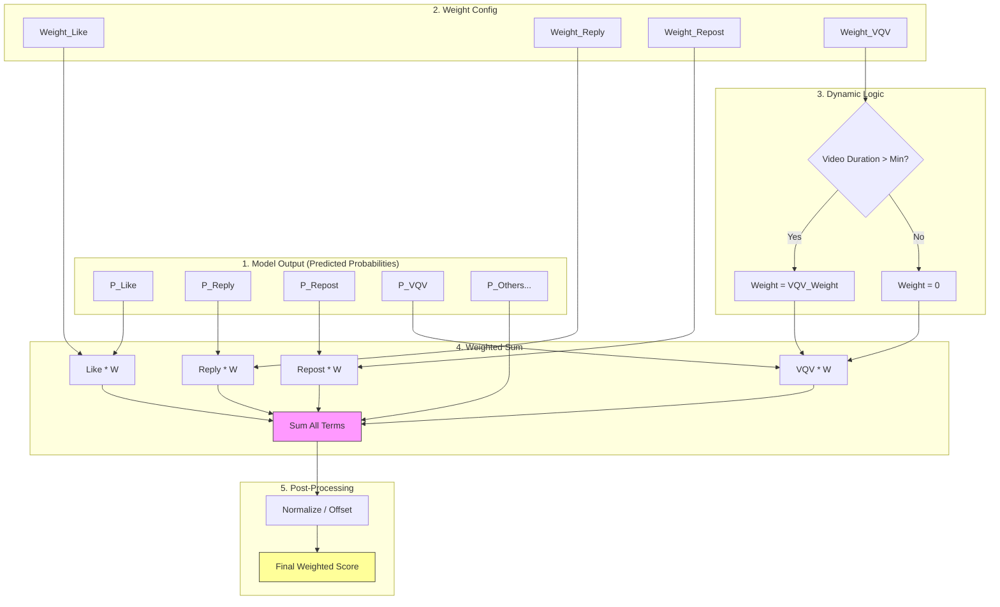

# Chapter 4: Scoring & Ranking

After the model predicts 10+ action probabilities for each tweet, how do we decide which tweet ranks first? This requires **Scoring** logic.

Code location: `home-mixer/scorers/`

## 4.1 PhoenixScorer: Fetching Predictions

First, `PhoenixScorer` calls the model service to get raw probabilities.

It parses the model output and fills it into the `phoenix_scores` field of `PostCandidate`. These scores include:
*   `favorite_score`: P(Like)
*   `reply_score`: P(Reply)
*   `retweet_score`: P(Repost)
*   `share_score`: P(Share)
*   `block_author_score`: P(Block) - Negative signal
*   `not_interested_score`: P(Not Interested) - Negative signal
*   ... and more

Implementation: `home-mixer/scorers/phoenix_scorer.rs`

## 4.2 WeightedScorer: Weighted Fusion

This is where algorithm engineers adjust "business goals". We guide the recommendation system's tendency by assigning different Weights to different behaviors.

The formula is simple:
```
Final Score = Σ (Probability_i * Weight_i)
```

Implementation: `home-mixer/scorers/weighted_scorer.rs`



```rust
fn compute_weighted_score(candidate: &PostCandidate) -> f64 {
    let s = &candidate.phoenix_scores;
    
    // Dynamic weight example: if video is too short, no VQV (Video Quality View) weight
    let vqv_weight = if video_duration > MIN_DURATION { p::VQV_WEIGHT } else { 0.0 };

    let combined_score = 
          s.favorite_score * p::FAVORITE_WEIGHT
        + s.reply_score    * p::REPLY_WEIGHT
        + s.retweet_score  * p::RETWEET_WEIGHT
        + s.block_author_score * p::BLOCK_AUTHOR_WEIGHT // Note: Weights are usually negative
        + ...; // Sum all terms
        
    // Normalization
    Self::offset_score(combined_score)
}
```

### 4.2.1 Meaning of Weights
*   If `REPLY_WEIGHT` is high, the system will tend to recommend topics that easily spark discussion (possibly even controversial ones).
*   If `LIKE_WEIGHT` is high, the system will tend to recommend light, pleasant content.
*   If `BLOCK_AUTHOR_WEIGHT` is a large negative number, the system will strive to avoid recommending content that might cause users to block authors.

By adjusting these parameters `p::*`, we can fine-tune the community atmosphere.

## 4.3 OONScorer: Network Regulation

`OON` stands for **Out-Of-Network**.

Usually, to protect the user's "Following Feed" experience, we demote "non-following recommendations" to prevent the Feed from being flooded by strangers.

Implementation: `home-mixer/scorers/oon_scorer.rs`

```rust
match c.in_network {
    Some(false) => base_score * p::OON_WEIGHT_FACTOR, // e.g. multiply by 0.8
    _ => base_score,
}
```

## 4.4 AuthorDiversityScorer: Diversity Shuffle

If tweets from the same author have consistently high scores, to avoid the Feed becoming monotonous, we need to suppress them.

This Scorer records the number of times each author appears in the current Batch. The score is discounted on the second appearance, more on the third, and so on.

## 4.5 Final Selection

After processing by the series of Scorers above, each `PostCandidate` has a final `weighted_score`.

`TopKScoreSelector` is simple:
1.  Sort descending by `weighted_score`.
2.  Take top `K` (e.g., 20).
3.  Discard the rest.

---
**Next Step**: Read `05_filtering_rules.md` to learn what other "hidden rules" eliminate tweets.
