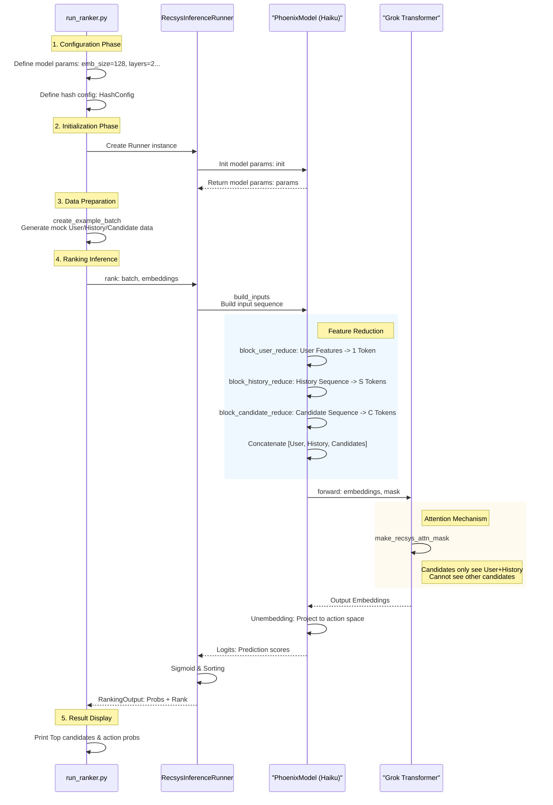

# Deep Dive into run_ranker.py

`run_ranker.py` is the core demo script of the Phoenix recommendation system. It simulates a complete recommendation ranking process: from constructing user profile and history, to generating candidate posts, and finally predicting user interaction probabilities for each candidate post via a Transformer model.

This document will analyze the script's function, core components, and data flow in detail.

## 1. Script Core Functions

The script mainly demonstrates the following four key steps:

1.  **Model Configuration**: Define Transformer architecture parameters (layers, heads, embedding dimension) and recommendation system business parameters (history length, candidate set size).
2.  **Initialization**: Initialize `RecsysInferenceRunner`, the bridge connecting business logic and underlying Haiku/JAX models.
3.  **Data Simulation**: Use `create_example_batch` to generate random tensors conforming to real data structures, simulating user features, history sequence, and candidate posts.
4.  **Inference & Ranking**: Execute model forward propagation, calculate predicted probabilities for each candidate post on different interaction behaviors (Like, Reply, Repost), and sort accordingly.

## 2. System Execution Flowchart

The following flowcharts show the complete path from script startup to result output.

### 2.1 Data Flow

```mermaid
graph TD
    subgraph "1. Configuration"
        Config[PhoenixModelConfig<br/>Parameter Def] --> RunnerInit[RecsysInferenceRunner<br/>Init]
    end
    
    subgraph "2. Data Simulation"
        CreateBatch[create_example_batch] --> BatchData[RecsysBatch<br/>(Hashes/Actions)]
        CreateBatch --> EmbData[RecsysEmbeddings<br/>(Mock Embeddings)]
    end
    
    RunnerInit & BatchData & EmbData --> RankCall[runner.rank()]
    
    subgraph "3. Feature Engineering"
        RankCall --> BuildInputs[build_inputs]
        BuildInputs --> ReduceUser[User Reduce]
        BuildInputs --> ReduceHist[History Reduce]
        BuildInputs --> ReduceCand[Candidate Reduce]
        
        ReduceUser & ReduceHist & ReduceCand --> Concat[Concat & Mask]
    end
    
    subgraph "4. Inference"
        Concat --> Forward[Transformer Forward]
        Forward --> OutEmb[Output Embeddings]
        OutEmb --> Unembed[Unembedding Projection]
        Unembed --> Logits[Logits<br/>Prediction Scores]
    end
    
    subgraph "5. Result Processing"
        Logits --> Sigmoid[Sigmoid<br/>Normalization]
        Sigmoid --> Sorting[Sort by Score<br/>Ranking]
        Sorting --> Print[Print Results]
    end
    
    style Config fill:#f9f,stroke:#333
    style RankCall fill:#ff9,stroke:#333
    style Print fill:#f9f,stroke:#333
```

### 2.2 Sequence Diagram



## 3. Key Code Module Analysis

### 3.1 Model Configuration (`PhoenixModelConfig`)
Location: `run_ranker.py:38-54`

This is the blueprint. Note `hash_config`, which defines how many hash functions represent an entity (User, Post, Author).
*   **Multi-Hashing**: The system doesn't use a huge single Embedding Table, but multiple smaller Tables. E.g., `num_item_hashes=2` means one Post ID is hashed into 2 indices, looked up, then summed or concatenated. This saves memory and handles massive sparse IDs.

### 3.2 Data Simulation (`create_example_batch`)
Location: `run_ranker.py:75` / `phoenix/runners.py:389`

Generates two types of data:
1.  **`RecsysBatch` (Feature Indices)**: Discrete data like ID hashes, action types, product surface.
2.  **`RecsysEmbeddings` (Pre-lookup Embeddings)**: In production, Embedding lookup is often done outside the model. Here we simulate already looked-up Embedding vectors.

### 3.3 Feature Reduction (`block_*_reduce`)
Location: `phoenix/recsys_model.py:79-242`

The model uses a "Reduce" strategy to compress multimodal features into Transformer Tokens:
*   **User Reduce**: Project user's multiple hash Embeddings into one vector -> **User Token**.
*   **History Reduce**: Concatenate Post/Author/Action/Surface Embeddings for each history tweet and project -> **History Tokens**.
*   **Candidate Reduce**: Similar to history, but without Action Embedding (since we're predicting it) -> **Candidate Tokens**.

Final Transformer input sequence:
`[User Token] + [History Tokens (Seq Len)] + [Candidate Tokens (Seq Len)]`

### 3.4 Customized Attention Mask (`make_recsys_attn_mask`)
Location: `phoenix/grok.py:39`

The essence of this Ranker. Ordinary Transformers (GPT) use Causal Mask.
But in recommendation ranking, we must score multiple candidates simultaneously, and **candidates are independent**.
*   **User & History**: Can see each other.
*   **Candidate $i$**: Can see User and History, and self, but **absolutely cannot see Candidate $j$**.

Implementation Logic:
```python
# 1. Base Causal Mask
causal_mask = jnp.tril(...) 

# 2. Cut connections between candidates
# Set attention in candidate area to 0
attn_mask = causal_mask.at[:, :, candidate_start:, candidate_start:].set(0)

# 3. Restore candidate self-attention
# Candidates see themselves
attn_mask = attn_mask.at[:, :, candidate_indices, candidate_indices].set(1)
```

## 4. Output Explanation

The script outputs `RANKING RESULTS`:

```text
Rank 1: 
  Predicted engagement probabilities:
    Favorite Score          : ██████████ 0.500
    Reply Score             : ██████████ 0.500
    ...
```

*   **Multi-Task Learning**: Predicts all interaction behaviors (`num_actions`) at once.
*   **Logits to Probabilities**: `Sigmoid` converts logits to 0-1 probabilities.
*   **Ranking Basis**: Usually sorts by weighted sum or specific target (like `Favorite Score`).

## 5. Summary

`run_ranker.py` reveals the standard paradigm of modern deep learning recommendation systems:
1.  **Sparse Features**: Use Hash Embedding for massive sparse IDs.
2.  **Sequence Modeling**: Use Transformer to capture user history patterns.
3.  **Feature Interaction**: Auto-learn User-Item matching via Self-Attention.
4.  **Efficiency**: Score multiple candidates in one Forward Pass using custom Mask.
