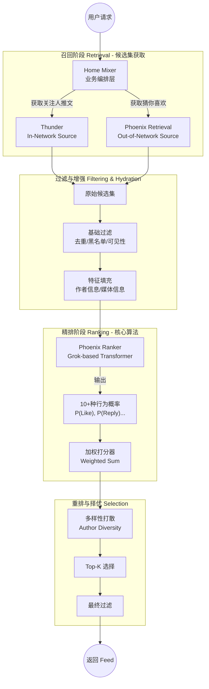

# 第1章：全景概览 (System Overview)

## 1.1 写在前面：算法工程师的视角

作为算法工程师，在接触 X 的推荐系统（For You Feed）时，你可能会惊讶于它的**简洁性**。与传统推荐系统堆砌大量手工特征（Feature Engineering）不同，该系统采用了**端到端（End-to-End）**的深度学习范式。

核心理念可以概括为：
> **Eliminate hand-engineered features.** (消除手工特征)
> 让模型通过理解用户的**行为序列 (User Action Sequence)** 和**内容本身 (Content Embeddings)** 来自动学习什么是“相关性”。

## 1.2 系统架构全景图

整个推荐服务可以看作是一个巨大的漏斗，从海量推文中筛选出最相关的 Top-K 条内容。

## 1.3 核心组件三剑客

理解这三个组件是掌握整个系统的关键：

### 1. Home Mixer (指挥官)
- **定位**：业务逻辑编排层，Rust 实现。
- **职责**：它不负责存储数据，也不负责训练模型。它像一个“主板”，把召回源、特征服务、模型服务串联起来。
- **核心逻辑**：基于 `CandidatePipeline` 框架，定义了数据流动的标准过程：`Source -> Hydrator -> Filter -> Scorer -> Selector`。

### 1. Thunder (内部记忆)
- **定位**：In-Network（关注流）实时存储与检索引擎。
- **职责**：
    - 存储用户最近的推文（基于内存，极其高效）。
    - 当用户刷新 Feed 时，迅速返回其**关注的人**最近发布的推文。
    - 处理 Kafka 消息流，实时更新推文状态。

### 1. Phoenix (最强大脑)
- **定位**：基于深度学习的推荐算法中心。
- **职责**：
    - **Retrieval (召回)**: 使用双塔模型（Two-Tower）从全网海量推文中捞出用户可能感兴趣的“非关注”内容。
    - **Ranking (精排)**: 使用基于 Grok-1 的 Transformer 模型，对所有候选推文（无论是关注的还是未关注的）进行统一打分。
    - **特点**：模型直接预测用户对推文产生各种交互（点赞、回复、转发等）的概率。

## 1.4 数据流向 (Data Flow)

当一个用户刷新 "For You" 页面时，数据流向如下：

1.  **请求发起**: `Home Mixer` 收到请求。
2.  **上下文获取**: 获取当前用户的特征（User Features）和历史行为序列（User Action Sequence）。
3.  **双路召回**:
    *   向 `Thunder` 要“关注人的推文”。
    *   向 `Phoenix Retrieval` 要“全网热门/相关推文”。
4.  **特征补全**: 拿着推文 ID 去由于特征服务（如 Gizmoduck, User Data Service）拉取推文详情和作者详情。
5.  **初筛**: 过滤掉看过的、拉黑的、敏感内容。
6.  **统一打分**: 将处理好的候选集（包含推文内容 + 用户行为历史）打包送给 `Phoenix Ranker`。
7.  **计算总分**: 模型返回预测概率 -> 加权求和 -> 得到最终分数。
8.  **截断返回**: 按分数排序，取前 K 个，返回给客户端。

## 1.5 总结

这个架构最大的亮点在于**统一性**。
无论内容来自哪里（关注 vs 非关注），最终都由同一个强大的 Transformer 模型（Phoenix）进行公平竞争打分。这保证了内容分发的质量主要取决于内容本身与用户的相关性，而非来源渠道。

---
**下一步**: 阅读 `02_home_mixer_logic.md`，深入了解业务编排层的代码实现细节。