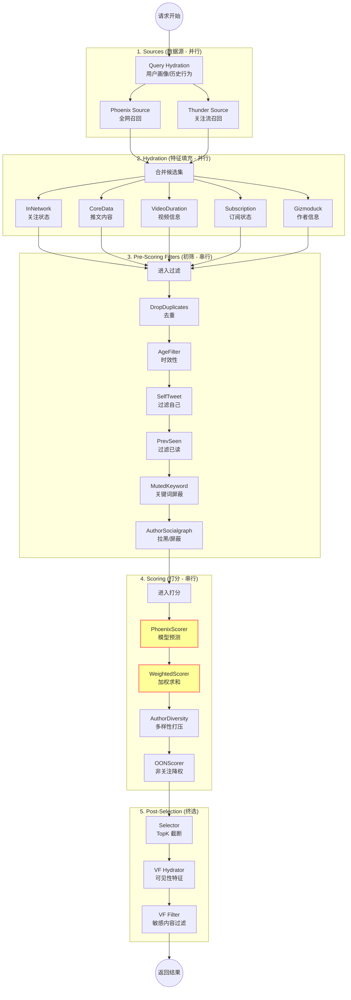

# 第2章：业务编排层详解 (Home Mixer Logic)

`Home Mixer` 是整个推荐系统的“大脑”和“指挥官”。它不生产数据，而是负责协调各个组件，完成从请求到响应的整个流程。

## 2.1 核心设计模式：Pipeline

Home Mixer 采用了 **Pipeline（管道）** 设计模式。这种模式将复杂的推荐流程拆解为一系列标准化的、可插拔的步骤。

代码位置：`candidate-pipeline/lib.rs` 定义了这些 Trait（接口）：

| 阶段 (Trait) | 职责 | 对应组件示例 |
| :--- | :--- | :--- |
| **Source** | **找米下锅**。负责从上游数据源拉取原始候选 ID。 | `ThunderSource`, `PhoenixSource` |
| **Hydrator** | **洗菜切菜**。负责丰富候选集的数据（填充特征）。 | `CoreDataHydrator` (查推文详情), `GizmoduckHydrator` (查作者信息) |
| **Filter** | **择菜**。负责剔除不符合要求的候选。 | `DropDuplicatesFilter` (去重), `MutedKeywordFilter` (屏蔽词) |
| **Scorer** | **炒菜**。负责给每个候选打分。 | `PhoenixScorer` (模型预测), `WeightedScorer` (加权求和) |
| **Selector** | **装盘**。负责排序并选出 Top-K。 | `TopKScoreSelector` |
| **SideEffect** | **收拾厨房**。负责异步执行非阻塞任务。 | `CacheRequestInfoSideEffect` (记录日志/缓存) |

## 2.2 核心实现：PhoenixCandidatePipeline

`PhoenixCandidatePipeline` 是 Home Mixer 中最重要的 Pipeline 实现，专门用于 "For You" Feed。

代码位置：`home-mixer/candidate_pipeline/phoenix_candidate_pipeline.rs`

让我们深入源码，看看它是如何组装的：



### 2.2.1 组装 Sources (数据源)
```rust
// 这是一个混合源 Pipeline，同时包含两个源：
let phoenix_source = Box::new(PhoenixSource { ... }); // 召回源 (Out-of-Network)
let thunder_source = Box::new(ThunderSource { ... }); // 关注源 (In-Network)
let sources = vec![phoenix_source, thunder_source];
```
系统会**并行**调用这两个 Source，然后将结果合并。这体现了“混合流”的设计思想。

### 2.2.2 组装 Hydrators (特征填充)
```rust
let hydrators = vec![
    Box::new(InNetworkCandidateHydrator), // 标记是否为关注人
    Box::new(CoreDataCandidateHydrator::new(...)), // 核心数据：推文内容、媒体链接
    Box::new(VideoDurationCandidateHydrator::new(...)), // 视频时长
    Box::new(SubscriptionHydrator::new(...)), // 订阅/付费墙状态
    Box::new(GizmoduckCandidateHydrator::new(...)), // 作者信息：是否蓝标、粉丝数等
];
```
注意：Hydration 是最耗时的步骤之一，通常会通过异步并发请求来优化。

### 2.2.3 组装 Filters (过滤器)
```rust
let filters = vec![
    Box::new(DropDuplicatesFilter), // 去重
    Box::new(AgeFilter::new(...)), // 去除太旧的推文
    Box::new(SelfTweetFilter), // 不推荐自己发的推文
    Box::new(PreviouslySeenPostsFilter), // 去除看过的
    Box::new(MutedKeywordFilter::new()), // 关键词屏蔽
    // ... 更多过滤器
];
```
过滤器的顺序很重要，通常计算代价小、过滤比例大的过滤器放在前面。

### 2.2.4 组装 Scorers (打分器)
这是算法最关心的部分，它们是**串行**执行的，后一个 Scorer 可以利用前一个 Scorer 的结果。

```rust
let scorers = vec![
    // 1. 核心模型打分：调用 Grok Transformer 预测 P(Like), P(Reply) 等
    Box::new(PhoenixScorer { phoenix_client }), 
    
    // 2. 加权融合：将上述概率加权求和，得到 weighted_score
    Box::new(WeightedScorer),
    
    // 3. 多样性打压：如果同一个作者出现多次，降低其分数
    Box::new(AuthorDiversityScorer::default()),
    
    // 4. OON 降权：(可选) 对非关注内容进行降权，平衡 Feed 比例
    Box::new(OONScorer),
];
```

## 2.3 为什么这么设计？

1.  **解耦 (Decoupling)**: 业务逻辑（Filters, Scorers）与执行框架（Pipeline Runner）分离。算法工程师只需要写新的 Scorer，不需要关心并发控制和错误处理。
2.  **灵活性 (Flexibility)**: 想要加一个新的过滤规则？只需要实现 `Filter` trait 并加入 `vec!` 列表即可，无需修改核心流程。
3.  **可测试性 (Testability)**: 每个组件（如 `AgeFilter`）都可以单独编写单元测试。

## 2.4 关键数据结构：PostCandidate

在整个 Pipeline 中流转的核心数据结构是 `PostCandidate`。

```rust
pub struct PostCandidate {
    // 基础 ID
    pub tweet_id: u64,
    pub author_id: u64,
    
    // 来源标记
    pub in_network: Option<bool>, // true=来自关注, false=来自推荐
    
    // 模型打分结果 (由 PhoenixScorer 填充)
    pub phoenix_scores: PhoenixScores, 
    
    // 最终分数 (由 WeightedScorer 计算)
    pub weighted_score: Option<f64>,
    
    // ... 其他特征数据
}
```

---
**下一步**: 阅读 `03_phoenix_model.md`，深入算法核心，了解那个神秘的 Grok-based Transformer 模型。