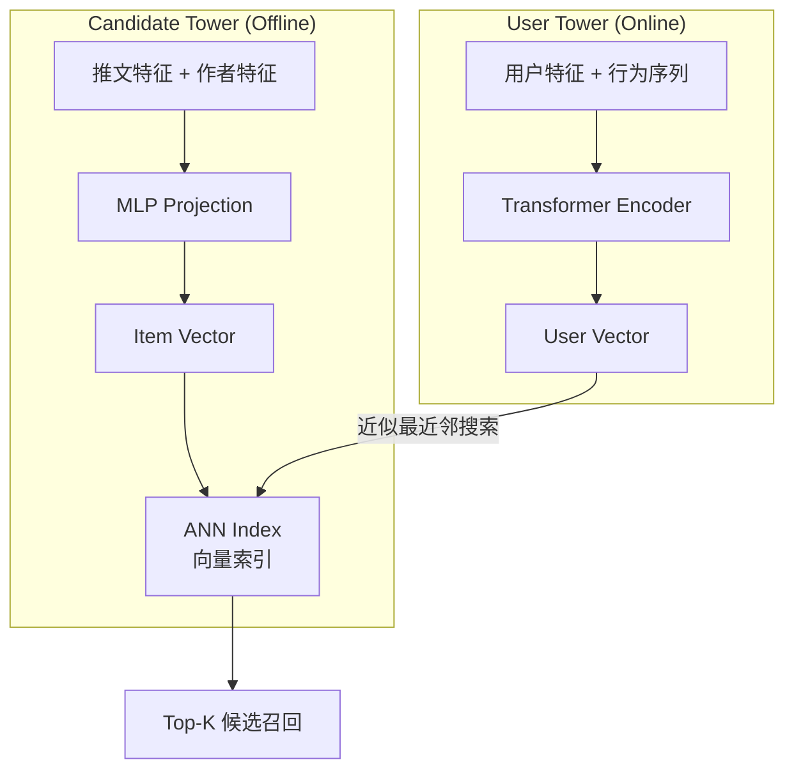
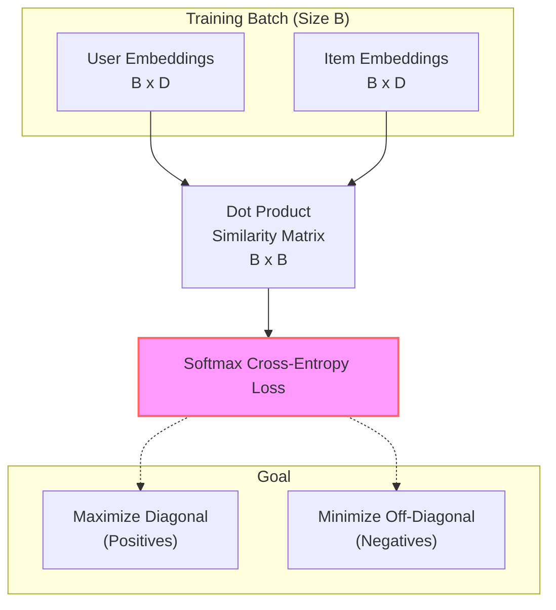
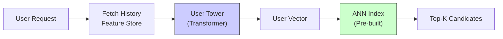
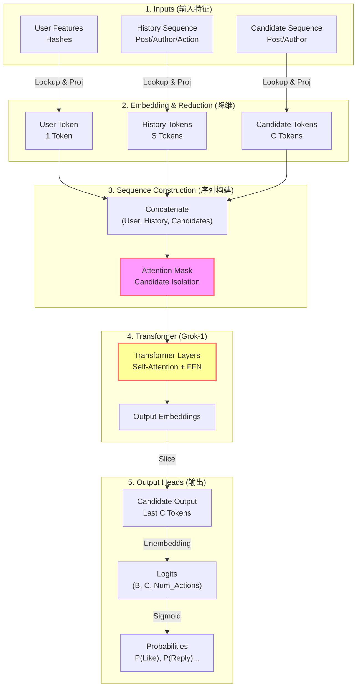

# 第3章：核心算法模型 (Phoenix Model)

Phoenix 是整个推荐系统的核心算法引擎，基于 JAX 实现。它由两个主要部分组成：**Retrieval (召回)** 和 **Ranking (精排)**。

代码位置：`phoenix/` 目录。

## 3.1 Retrieval: 双塔模型 (Two-Tower)

在召回阶段，我们需要从数亿条推文中快速找出几百条相关的。这里使用的是经典的双塔结构。

### 3.1.1 架构原理

Phoenix 的双塔模型并非使用 LightGCN 等图神经网络，而是采用 **Transformer + MLP** 的混合架构：

*   **User Tower (用户塔)**: 采用 **Transformer** (Grok-1 架构)。
    *   原因：用户兴趣主要体现在其行为序列 (History Sequence) 中，Transformer 擅长捕捉序列特征。
    *   输出：`User Embedding [D]`
*   **Candidate Tower (物品塔)**: 采用 **MLP (多层感知机)**。
    *   原因：推文特征（ID, 作者, 表面特征等）相对静态且结构简单，MLP 足够高效。
    *   输出：`Item Embedding [D]`
*   **相似度计算**: 使用点积 (Dot Product)。



### 3.1.2 为什么用双塔？
双塔最大的优势是 **解耦**。
*   **离线计算**: 我们可以预先计算好全网所有推文的 Item Embeddings，并建立 ANN (近似最近邻) 索引。
*   **在线服务**: 用户请求来时，只需实时计算 User Embedding，然后在索引中进行向量检索 (Vector Search)，速度极快。

### 3.1.3 训练方法 (Training)

双塔模型的训练核心是 **对比学习 (Contrastive Learning)**。

**训练目标**:
让 User Embedding 与用户真正交互过的 Item Embedding (正样本) 距离尽可能近，而与未交互过的 Item Embedding (负样本) 距离尽可能远。

**In-batch Negatives (批内负样本)**:
为了提高训练效率，我们通常不显式采样负样本，而是利用 Batch 内的其他样本作为负样本。假设一个 Batch 有 $B$ 个样本，每个样本由 `(User_History, Target_Item)` 组成：
*   **正样本**: 对于第 $i$ 个用户 $U_i$，他对应的正样本是 $I_i$（用户实际交互的 Item）。
*   **负样本**: Batch 内的其他所有 Item $I_j (j \neq i)$ 都被视为 $U_i$ 的负样本。

这样，一个 Batch 就可以构建出 $B \times B$ 的相似度矩阵。

**损失函数 (Loss Function)**:
使用 **Softmax Cross-Entropy Loss**。对于每个用户 $U_i$，我们希望模型能从 Batch 的 $B$ 个 Item 中，正确地“分类”出 $I_i$。

$$
L = -\frac{1}{B} \sum_{i=1}^{B} \log \frac{\exp(sim(U_i, I_i) / \tau)}{\sum_{j=1}^{B} \exp(sim(U_i, I_j) / \tau)}
$$

其中 $sim(\cdot)$ 是点积相似度，$\tau$ 是温度系数 (Temperature)。



### 3.1.4 在线推理 (Online Inference)

用户请求到达时，系统需要实时计算 User Embedding 并检索。

**流程**:
1.  **特征获取**: 从 Feature Store 拉取用户最新的交互历史序列（例如最近 50 次交互）。
2.  **User Tower 推理**: 将序列输入 User Tower (Transformer)。
    *   **低延迟原理**: 推荐场景下的序列长度通常较短 (e.g., 32~128)，Transformer 处理这种长度的序列非常快 (毫秒级)。
    *   **只算一侧**: 此时**不需要**计算 Item Tower。全网 Item 的向量已经离线计算好并构建了 ANN 索引。
3.  **ANN 检索**: 使用计算出的 User Embedding 在 ANN 索引中查找最近邻的 K 个 Item。



## 3.2 Ranking: 候选集隔离 Transformer

在精排阶段，我们面对的是召回回来的几百条候选，可以使用更复杂的模型。Phoenix Ranking Model 是一个基于 Grok-1 的 Transformer。



### 3.2.1 核心创新：Candidate Isolation (候选集隔离)

普通的 Transformer (如 BERT/GPT) 中，序列中的所有 token 都可以相互看见（Self-Attention）。但在推荐排序中，如果我们把 `[User, Candidate A, Candidate B, ...]` 一起输入模型，会有一个严重问题：
> **Candidate A 的得分可能会受到 Candidate B 是否存在的影响。**

这会导致打分不稳定，且无法缓存。
Phoenix 通过精心设计的 **Attention Mask** 解决了这个问题：

```
Attention Mask (谁能看谁):

          | User | History | Cand A | Cand B |
----------|------|---------|--------|--------|
User      |  ✅  |    ✅    |   ❌   |   ❌   |
History   |  ✅  |    ✅    |   ❌   |   ❌   |
Cand A    |  ✅  |    ✅    |   ✅   |   ❌   |  <-- A 只能看 User/History 和自己
Cand B    |  ✅  |    ✅    |   ❌   |   ✅   |  <-- B 只能看 User/History 和自己
```

**结论**: 候选之间互不可见 (Candidates CANNOT attend to each other)。这使得我们可以一次性并行给多个候选打分，同时保证每个候选的分数是独立的。

### 3.2.2 输入特征 (Features)

模型不使用手工特征，而是直接学习 Embedding。

1.  **User Hashes**: 用户 ID 的哈希映射。
2.  **History Sequence**: 用户最近交互过的推文序列。每个历史推文包含：
    *   `Post Embedding`: 推文内容的向量。
    *   `Author Embedding`: 作者的向量。
    *   `Action Type`: 用户当时做了什么操作（点赞、回复等）。
    *   `Product Surface`: 在哪里交互的（主页、详情页等）。
3.  **Candidate Sequence**: 待打分的候选推文序列。包含 Post/Author Embedding 等。

代码实现见 `phoenix/recsys_model.py` 中的 `RecsysBatch` 类。

### 3.2.3 输出：多目标预测 (Multi-Task Learning)

模型并不输出单一的 scalar score，而是输出一个向量 `[num_actions]`，代表预测的多种行为概率。

```python
# recsys_model.py
class RecsysModelOutput(NamedTuple):
    logits: jax.Array 
    # Shape: [Batch_Size, Num_Candidates, Num_Actions]
```

`Num_Actions` 对应预定义的行为列表（如 Like, Reply, Repost 等）。这种设计让模型专注于学习“用户会做什么”，而不是“这个东西多少分”，后者留给业务层去加权定义。

## 3.3 代码导读

如果你想深入阅读源码，建议按以下顺序：

1.  **`phoenix/recsys_model.py`**: 定义了模型结构。
    *   关注 `PhoenixModel` 类和 `__call__` 方法。
    *   关注 `block_history_reduce` 等函数，看 embedding 是如何聚合的。
2.  **`phoenix/run_ranker.py`**: 一个本地运行的 Demo。
    *   它模拟了一个 batch 的数据，运行模型，并打印出每个候选的预测概率。
    *   是理解模型输入输出格式的最好入口。

---
**下一步**: 阅读 `04_scoring_and_ranking.md`，了解这些预测概率是如何变成最终排序分数的。