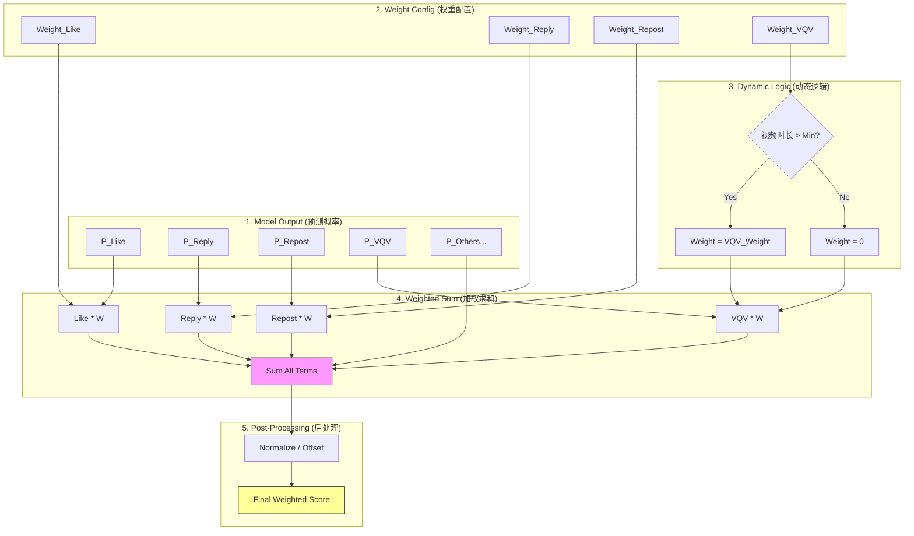

# 第4章：打分与排序逻辑 (Scoring & Ranking)

当模型预测出每条推文的 10+ 种行为概率后，我们如何决定哪条推文排第一？这就需要 **Scoring（打分）** 逻辑。

代码位置：`home-mixer/scorers/`

## 4.1 PhoenixScorer: 获取预测值

首先，`PhoenixScorer` 调用模型服务，获取原始概率。

它会将模型的输出解析并填充到 `PostCandidate` 的 `phoenix_scores` 字段中。这些分数包括：
*   `favorite_score`: P(Like)
*   `reply_score`: P(Reply)
*   `retweet_score`: P(Repost)
*   `share_score`: P(Share)
*   `block_author_score`: P(Block) - 负向信号
*   `not_interested_score`: P(Not Interested) - 负向信号
*   ... 以及更多

代码实现：`home-mixer/scorers/phoenix_scorer.rs`

## 4.2 WeightedScorer: 加权融合

这是算法工程师调整“业务目标”的地方。我们通过给不同的行为赋予不同的权重（Weights），来引导推荐系统的倾向。

公式很简单：
```
Final Score = Σ (Probability_i * Weight_i)
```

代码实现：`home-mixer/scorers/weighted_scorer.rs`



```rust
fn compute_weighted_score(candidate: &PostCandidate) -> f64 {
    let s = &candidate.phoenix_scores;
    
    // 动态权重示例：如果视频太短，就没有 VQV (Video Quality View) 权重
    let vqv_weight = if video_duration > MIN_DURATION { p::VQV_WEIGHT } else { 0.0 };

    let combined_score = 
          s.favorite_score * p::FAVORITE_WEIGHT
        + s.reply_score    * p::REPLY_WEIGHT
        + s.retweet_score  * p::RETWEET_WEIGHT
        + s.block_author_score * p::BLOCK_AUTHOR_WEIGHT // 注意：权重通常是负数
        + ...; // 累加所有项
        
    // 归一化处理
    Self::offset_score(combined_score)
}
```

### 4.2.1 权重的意义
*   如果 `REPLY_WEIGHT` 很大，系统会倾向于推荐容易引起讨论的话题（甚至可能是争议性话题）。
*   如果 `LIKE_WEIGHT` 很大，系统会倾向于推荐轻松、令人愉悦的内容。
*   如果 `BLOCK_AUTHOR_WEIGHT` 是很大的负数，系统会极力避免推荐可能导致用户拉黑作者的内容。

通过调整这些参数 `p::*`，我们可以微调社区氛围。

## 4.3 OONScorer: 网络调节

`OON` 代表 **Out-Of-Network**（非关注网络）。

通常为了保护用户的“关注流”体验，我们会对“非关注推荐”进行降权，防止 Feed 被陌生人刷屏。

代码实现：`home-mixer/scorers/oon_scorer.rs`

```rust
match c.in_network {
    Some(false) => base_score * p::OON_WEIGHT_FACTOR, // 例如乘以 0.8
    _ => base_score,
}
```

## 4.4 AuthorDiversityScorer: 多样性打散

如果同一个作者的推文连续得分都很高，为了避免 Feed 变得单调，我们需要进行打压。

这个 Scorer 会记录当前 Batch 中每个作者出现的次数。第二次出现时分数打折，第三次打更多折，以此类推。

## 4.5 最终排序 (Selection)

经过上述一系列 Scorer 的处理，每个 `PostCandidate` 都有了一个最终的 `weighted_score`。

`TopKScoreSelector` 很简单：
1.  按 `weighted_score` 降序排列。
2.  取前 `K` 个（例如 20 个）。
3.  丢弃剩下的。

---
**下一步**: 阅读 `05_filtering_rules.md`，了解系统还有哪些“潜规则”会把推文过滤掉。