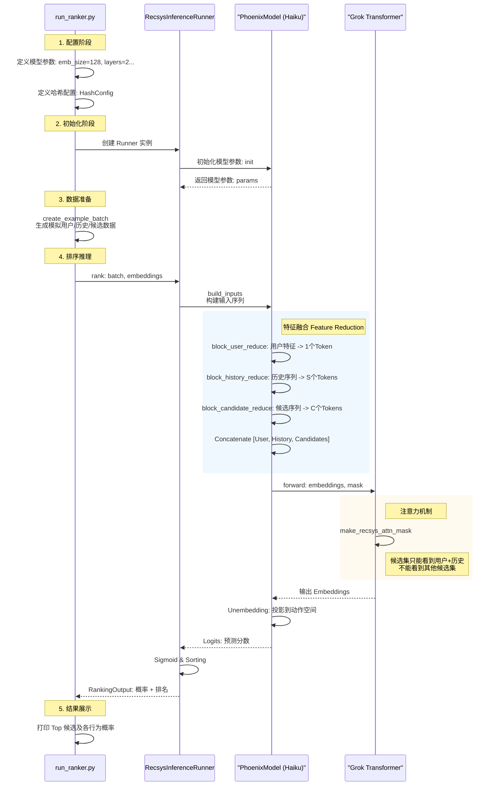

# run_ranker.py 深度解析

`run_ranker.py` 是 Phoenix 推荐系统的核心演示脚本。它模拟了一个完整的推荐排序流程：从构建用户画像和历史行为，到生成候选帖子，最后通过 Transformer 模型预测用户对每个候选帖子的互动概率。

本文档将详细分析该脚本的作用、核心组件以及数据流转过程。

## 1. 脚本核心作用

该脚本主要演示了以下四个关键步骤：

1.  **模型配置 (Configuration)**: 定义 Transformer 的架构参数（层数、头数、嵌入维度）以及推荐系统的业务参数（历史长度、候选集大小）。
2.  **环境初始化 (Initialization)**: 初始化 `RecsysInferenceRunner`，这是连接业务逻辑与底层 Haiku/JAX 模型的桥梁。
3.  **数据模拟 (Data Simulation)**: 使用 `create_example_batch` 生成符合真实数据结构的随机张量（Tensors），模拟用户特征、历史行为序列和候选帖子。
4.  **推理排序 (Inference & Ranking)**: 执行模型前向传播，计算每个候选帖子在不同互动行为（如点赞、回复、转发）上的预测概率，并据此排序。

## 2. 系统执行流程图

下面的流程图展示了从脚本启动到输出结果的完整路径。

### 2.1 数据流转图 (Data Flow)

```mermaid
graph TD
    subgraph "1. Configuration (配置)"
        Config[PhoenixModelConfig<br/>参数定义] --> RunnerInit[RecsysInferenceRunner<br/>初始化]
    end
    
    subgraph "2. Data Simulation (数据模拟)"
        CreateBatch[create_example_batch] --> BatchData[RecsysBatch<br/>(Hashes/Actions)]
        CreateBatch --> EmbData[RecsysEmbeddings<br/>(Mock Embeddings)]
    end
    
    RunnerInit & BatchData & EmbData --> RankCall[runner.rank()]
    
    subgraph "3. Feature Engineering (特征工程)"
        RankCall --> BuildInputs[build_inputs]
        BuildInputs --> ReduceUser[User Reduce]
        BuildInputs --> ReduceHist[History Reduce]
        BuildInputs --> ReduceCand[Candidate Reduce]
        
        ReduceUser & ReduceHist & ReduceCand --> Concat[Concat & Mask]
    end
    
    subgraph "4. Inference (模型推理)"
        Concat --> Forward[Transformer Forward]
        Forward --> OutEmb[Output Embeddings]
        OutEmb --> Unembed[Unembedding Projection]
        Unembed --> Logits[Logits<br/>预测分数]
    end
    
    subgraph "5. Result Processing (结果处理)"
        Logits --> Sigmoid[Sigmoid<br/>归一化]
        Sigmoid --> Sorting[Sort by Score<br/>排序]
        Sorting --> Print[Print Results<br/>打印]
    end
    
    style Config fill:#f9f,stroke:#333
    style RankCall fill:#ff9,stroke:#333
    style Print fill:#f9f,stroke:#333
```

### 2.2 调用时序图 (Sequence Diagram)



## 3. 关键代码模块解析

### 3.1 模型配置 (`PhoenixModelConfig`)
代码位置: `run_ranker.py:38-54`

这是模型的蓝图。值得注意的是 `hash_config`，它定义了使用多少个哈希函数来表示一个实体（用户、帖子、作者）。
*   **多重哈希 (Multi-Hashing)**: 系统不使用巨大的单一 Embedding Table，而是使用多个较小的 Table。例如 `num_item_hashes=2` 意味着一个帖子 ID 会被哈希成 2 个索引，分别查表后相加或拼接。这是一种节省显存并处理海量稀疏 ID 的常用技术。

### 3.2 数据模拟 (`create_example_batch`)
代码位置: `run_ranker.py:75` / `phoenix/runners.py:389`

这个函数生成了两类数据：
1.  **`RecsysBatch` (特征索引)**: 包含 ID 的哈希值、动作类型、表面特征（Product Surface）等离散数据。
2.  **`RecsysEmbeddings` (预查找嵌入)**: 在实际生产环境中，Embedding 查找通常在模型外部或底层完成。这里模拟了已经查找好的 Embedding 向量。

### 3.3 特征融合 (`block_*_reduce`)
代码位置: `phoenix/recsys_model.py:79-242`

模型并不是简单地将所有特征拼接。它使用了 "Reduce" 策略将多模态特征压缩成 Transformer 的 Token：
*   **User Reduce**: 将用户的多个哈希 Embedding 投影为一个向量 -> **User Token**。
*   **History Reduce**: 对历史中的每一条帖子，将其 Post Embedding、Author Embedding、Action Embedding（用户当时做了什么动作）和 Surface Embedding 拼接并投影 -> **History Tokens**。
*   **Candidate Reduce**: 类似历史，但没有 Action Embedding（因为这是我们要预测的） -> **Candidate Tokens**。

最终输入 Transformer 的序列结构是：
`[User Token] + [History Tokens (Seq Len)] + [Candidate Tokens (Seq Len)]`

### 3.4 定制化的注意力掩码 (`make_recsys_attn_mask`)
代码位置: `phoenix/grok.py:39`

这是该 Ranker 最精髓的部分。普通的 Transformer (如 GPT) 使用因果掩码 (Causal Mask)，即 Token $t$ 只能看到 $0...t$。

但在推荐排序中，我们需要同时给多个候选帖子打分，且**候选帖子之间是独立的**。
*   **User & History**: 可以互相看到（全注意力或因果注意力）。
*   **Candidate $i$**: 可以看到 User 和 History，也可以看到自己，但**绝不能看到 Candidate $j$**。

如果 Candidate $i$ 能看到 Candidate $j$，模型就会学会比较它们（"这个比那个好"），而不是独立打分。这会导致推理时必须输入同样的组合才能复现分数，破坏了打分的独立性。

代码实现逻辑：
```python
# 1. 基础因果掩码
causal_mask = jnp.tril(...) 

# 2. 切断候选集之间的联系
# 将候选集区域的注意力全部置 0
attn_mask = causal_mask.at[:, :, candidate_start:, candidate_start:].set(0)

# 3. 恢复候选集的自注意力
# 候选集自己可以看自己
attn_mask = attn_mask.at[:, :, candidate_indices, candidate_indices].set(1)
```

## 4. 输出解释

脚本最终输出的 `RANKING RESULTS` 展示了模型对每个候选帖子的预测。

```text
Rank 1: 
  Predicted engagement probabilities:
    Favorite Score          : ██████████ 0.500
    Reply Score             : ██████████ 0.500
    ...
```

*   **多目标预测 (Multi-Task Learning)**: 模型一次性预测了所有可能的互动行为 (`num_actions`)。
*   **Logits to Probabilities**: 模型输出的是 `logits`，通过 `Sigmoid` 函数转换为 0-1 之间的概率。
*   **排序依据**: 默认通常使用主要目标的加权和或特定目标（如 `Favorite Score`）进行排序。

## 5. 总结

`run_ranker.py` 揭示了现代深度学习推荐系统的标准范式：
1.  **Sparse Features**: 使用哈希 Embedding 处理海量稀疏 ID。
2.  **Sequence Modeling**: 使用 Transformer 捕捉用户的历史行为序列模式。
3.  **Feature Interaction**: 通过 Self-Attention 自动学习用户兴趣与候选帖子之间的匹配度。
4.  **Efficiency**: 通过定制 Mask 实现一次 Forward Pass 对多个候选集同时打分。